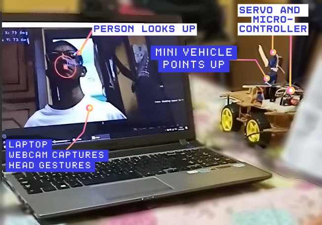
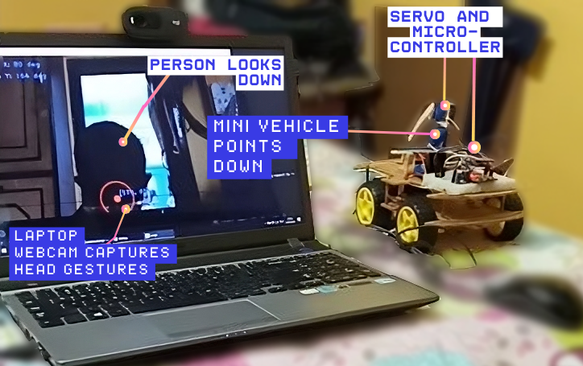
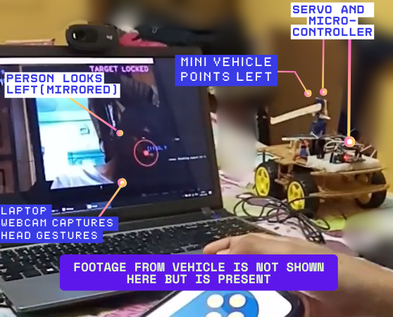
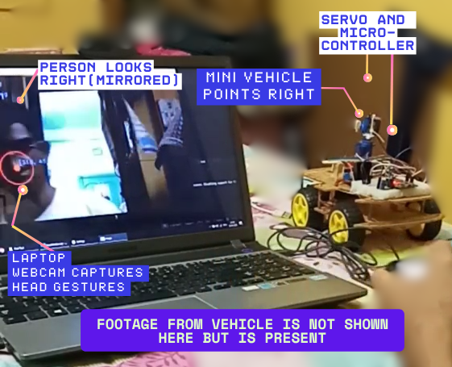

# Vision-Guided GazeBot

A camera-driven robotic system integrating computer vision with embedded control to translate human head gestures into directional motion. The project demonstrates **real-time gaze-based robotic pointing**, combining **MediaPipe**, **OpenCV**, and **ESP32** microcontroller-based servo actuation.

---

## System Overview

The **Vision-Guided GazeBot** establishes a seamless interface between a **Python-based vision module** and an **ESP32-driven robotic vehicle**.
- The **PC module** captures head movements through a webcam, using **MediaPipe Face Detection** to compute head displacement from the screen center.
- The **ESP32 module**, connected via **Bluetooth**, interprets these positional deltas to control **servo motors**, resulting in synchronized physical pointing of the robotic vehicle.
- Manual control remains available through the **Dabble ESP32 app (Play Store)** for direct motor operation, enabling hybrid manual–AI control.

---

## Hardware and Software Components

| Component | Description |
|------------|-------------|
| **ESP32** | Wi-Fi & Bluetooth-enabled microcontroller handling servo and motor control. |
| **Servo Motors** | Perform head-aligned directional pointing. |
| **Motor Driver + Vehicle Base** | Drives physical movement of the robot. |
| **Webcam (Laptop/PC)** | Captures live head movement. |
| **Python (MediaPipe + OpenCV)** | Processes camera frames to compute head position offsets. |
| **Bluetooth Communication** | Connects PC vision module and ESP32 for real-time control. |
| **Dabble ESP32 App** | Optional manual control interface for vehicle and servos. |

---

## Setup and Installation

### 1. ESP32 Environment
- **Board Manager Version:** `ESP32 by Espressif Systems v2.0.17`  
  ⚠️ Dabble does **not** function correctly on later board versions.
- **Libraries Used (Arduino IDE):**
  - `ESP32Servo` v3.0.7
  - `DabbleESP32` v1.5.1

Upload the `ESP32_Bluetooth_Car_Servo.ino` sketch to your ESP32 board.  
Once uploaded, the board automatically creates a Bluetooth interface accessible from the **Dabble app**.

### 2. Python Environment
**Recommended Python Version:** `Python 3.11`  
Using higher versions (e.g., 3.12+) may cause compatibility issues with **cvzone** or **mediapipe** dependencies.

#### Quick Setup (Automated)
Run the provided setup script to automatically create a virtual environment and install all dependencies:

```powershell
.\setup_gazebotenv.ps1
```

This script will:
1. Create a virtual environment named `gazebotenv`
2. Activate the environment
3. Upgrade pip
4. Install all dependencies from `requirements.txt`
5. Verify the installation

**Handling Execution Policy Errors:**
If you encounter an execution policy error when running the script, execute this command first:

```powershell
Set-ExecutionPolicy -ExecutionPolicy RemoteSigned -Scope CurrentUser
```

Then run the setup script again.

#### Manual Setup (Alternative)
If you prefer to set up manually:

```bash
python -m venv gazebotenv
.\gazebotenv\Scripts\Activate.ps1
pip install -r requirements.txt
```

**Project Dependencies (requirements.txt)**
```
cvzone==1.6.1
mediapipe==0.10.5
numpy==2.4.4
opencv-python==4.11.0.86
pyserial==3.5
```

> **Note:**  
> - `cvzone` internally depends on **MediaPipe**, which is automatically installed when installing `cvzone`.  
> - No explicit `mediapipe` import is required in the source code.


### 3. Bluetooth Connection
1. Pair ESP32 with your PC via Bluetooth.  
2. Note the COM port (Windows) or device path (Linux/macOS).  
3. Run the Python vision script (`facedetection.py` or `facdet.py`), ensuring it connects to the correct serial port.  
4. The script continuously detects head displacement and sends servo control signals accordingly.

---

## System Workflow

1. The webcam tracks the user's **face position** using **MediaPipe**.  
2. Displacement from the frame’s center determines the **servo motor’s angle**.  
3. ESP32 receives these position values via **Bluetooth Serial**.  
4. The robotic platform adjusts its servo-mounted pointer to **align with the user’s gaze direction**.  
5. Optional manual override: Dabble app can control the vehicle’s **movement and servo angles**.

---

## Demonstration

Below are real-world images from the project demo.

| | | |
|-|-|-|
|  |  |
| *Person looks up — bot points upward* | *Person looks down — bot points downward* |
|  |  |
| *Left head turn — bot points left* | *Right head turn — bot points right* |

---

## Directory Structure

```
ML-Vision-Guided-GazeBot/
│
├── facdet.py                     # Main program - Face detection and servo control
├── facedetection.py              # Alternative face detection module
├── setup_gazebotenv.ps1          # Automated environment setup script
├── requirements.txt              # Python dependencies
├── ESP32_Bluetooth_Car_Servo/
│   └── ESP32_Bluetooth_Car_Servo.ino   # Main control firmware
└── README.md
```

### Running the Main Program
The main program is located in **`facdet.py`**. To run it:

```powershell
# Activate the environment (if not already activated)
.\gazebotenv\Scripts\Activate.ps1

# Run the program
python facdet.py
```

Ensure:
- Your ESP32 is connected via Bluetooth
- The COM port in `facdet.py` matches your ESP32's connection port
- Your webcam is accessible and working

---

## Known Version Issues
- **Dabble ESP32** fails to compile on board versions > **2.0.17**.  
- Ensure the **ESP32Servo** library remains at **v3.0.7** for consistent PWM output.  
- Bluetooth Serial sometimes disconnects after sleep mode; reconnect manually if needed.
- **Python 3.11** is recommended — later versions can lead to OpenCV–cvzone runtime errors.


---

## Future Enhancements
- Integrate **gesture smoothing** using Kalman filters for stability.  
- Add **yaw-pitch-roll based mapping** for finer head motion interpretation.  
- Extend to **wireless camera input** or **edge-processed vision** (ESP32-CAM or Jetson Nano).
